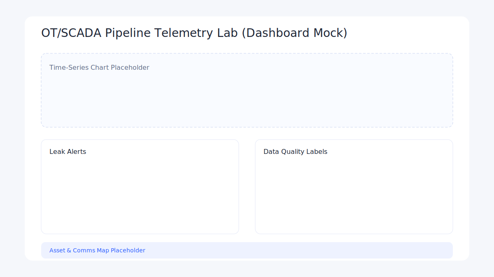

# OT/SCADA Pipeline Telemetry Lab — Data Quality + Leak Detection + Security Mapping

A resume-ready demo that showcases pipeline telemetry generation, data quality
labeling, leak detection, and OT/ICS security mapping with a local-first
operator dashboard.

## 60-second setup

```bash
cd telemetry_lab
python3 -m venv .venv
source .venv/bin/activate
python backend/generate_data.py
python backend/label_quality.py
python backend/detect_leaks.py
```

Optional UI:

```bash
cd ui
npm install
npm run dev
```

## Architecture (ASCII)

```text
┌─────────────┐      ┌───────────────────┐      ┌─────────────────┐
│ Generator   │      │ Quality Labeling  │      │ Leak Detection  │
│ generate_   │─────▶│ label_quality.py  │─────▶│ detect_leaks.py │
│ data.py     │      │ (labels, cleaned) │      │ (alerts)        │
└─────────────┘      └───────────────────┘      └─────────────────┘
         │                       │                        │
         ▼                       ▼                        ▼
     sample.csv             labels.json               alerts.json
         │                       │                        │
         └───────────────┬───────┴───────────────┬────────┘
                         ▼                       ▼
                   Operator Dashboard (React)    API (optional)
```

## Repo structure

```text
telemetry_lab/
  backend/
    generate_data.py
    label_quality.py
    detect_leaks.py
    server.py
  data/
    sample.csv
    labels.json
    golden/
  docs/
    SPEC_ARCH_REQS.md
    SUCCESS_METRICS.md
    AI_WORKFLOW.md
  schemas/
    labels.schema.json
    alerts.schema.json
    report.schema.json
  tests/
    (pytest + hypothesis)
  ui/
    (Vite + React app)
```

## What it demonstrates

- **Pipeline applications & leak detection**: EWMA detection with
  reason codes and persistence windows to reduce false alarms.
- **Data quality**: labeling missing data, flatlines, spikes, drift/outliers.
- **OT/ICS modernization**: operator dashboard, alert table, export workflows.
- **Security mapping**: asset inventory, comms paths, access levels, practical
  mitigations.

## Documentation

- `telemetry_lab/docs/SPEC_ARCH_REQS.md` — requirements + architecture sheet.
- `telemetry_lab/docs/SUCCESS_METRICS.md` — success metrics tracker.
- `telemetry_lab/docs/AI_WORKFLOW.md` — AI agent workflow playbook.
- `telemetry_lab/docs/TESTING_AND_CI.md` — test suite and CI gates.
- `CHECKLIST.md` — pre-commit commands for agents.
- `CI_FAIL_PLAYBOOK.md` — guidance for resolving CI failures.

## Screenshots



## Golden datasets

- `telemetry_lab/data/golden/seed_123.csv` is used by tests to verify the
  generator is reproducible for a fixed seed.
- `telemetry_lab/data/golden/quality_input.csv` and
  `telemetry_lab/data/golden/quality_expected_labels.json` validate labeling
  behavior for missing, flatline, spike, and drift.

## Testing & quality gates

Install dev dependencies:

```bash
pip install -r telemetry_lab/requirements-dev.txt
```

Run the full check suite:

```bash
make check
```

## Threats & mitigations (OT/ICS mindset)

- **Least privilege**: separate operator/engineer/admin roles, reduce standing
  privileges.
- **Segmentation**: isolate field devices, RTUs, historians, and analytics nodes.
- **Credential storage**: use OS-level keyrings or vaults; avoid plaintext in
  configs.
- **Monitoring**: log remote access and alert on anomalous commands.

## Limitations

- Detection logic is intentionally simple and threshold-based.
- UI is a scaffold with placeholder charting and export logic.
- Asset/comms map is a stub; add a real graph for a stronger demo.

## Next steps

- Replace placeholders with actual charting and CSV/JSON export.
- Add advanced detection (CUSUM, ROC/STA, isolation forest).
- Build a comms graph with attack path analysis.

## License

MIT
